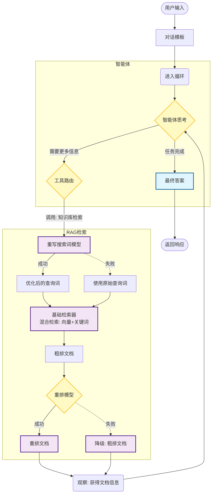

# AI Practice Partner - Agent Demo

## 项目简介

本项目是一个基于 Go 语言实现的 Agentic RAG（检索增强生成）演示系统，旨在展示如何构建一个具备自主检索、思考和回答能力的智能体。系统采用了 CloudWeGo Eino 框架进行编排，集成了 Elasticsearch 混合检索、查询重写（Rewrite）、结果重排（Rerank）等高级 RAG 技术。

## 核心设计思路

### 1. 架构概览

项目采用模块化设计，主要包含以下核心组件：

- **Agent (智能体)**: 基于 ReAct 范式，负责理解用户意图、规划任务并调用工具。
  - 支持多种 Agent 角色（BaseAgent, GentleAgent, GrumpyAgent）。
  - 使用 `orchestration.go` 进行图编排。
- **RAG Pipeline (检索流水线)**:
  - **Rewrite (重写)**: 使用 LLM 将用户自然语言转化为精准的搜索关键词。
  - **Retrieve (检索)**: 基于 Elasticsearch 的混合检索（向量 + 关键词），兼顾语义匹配和字面匹配。
  - **Rerank (重排)**: 对检索结果进行语义重排序，并进行 Top-K 截断和内容截断优化，大幅提升响应速度和精度。
- **Indexer (索引器)**:
  - 负责文档的加载、切片、向量化和入库。
  - 支持异步处理和文档结构化提取（关键词、摘要）。

### 2. 关键流程图

#### 智能体执行流程 (BaseAgent)



## 快速开始

### 前置要求

- Go 1.18+
- Elasticsearch 8.x
- OpenAI 兼容的 LLM API Key (配置在 `model.go` 等文件中)

### 启动步骤

1. **环境配置**:
   确保本地已安装并启动 Elasticsearch，并在代码中配置好连接信息（如 `Common/es_client.go`）。
2. **运行测试**:
   项目入口位于 `AgentDemo/main.go`，可以直接运行该文件启动演示。

   ```bash
   cd AgentDemo
   go run main.go
   ```
3. **测试逻辑**:
   `main.go` 会调用 `TestModel` 函数（位于 `testModel.go`），模拟用户输入并执行 Agent 流程。

## 目录结构说明

```
AgentDemo/
├── AgenticRag/
│   ├── Agent/          # 智能体实现 (Base, Gentle, Grumpy)
│   ├── Indexer/        # 知识库索引构建模块
│   ├── Retriever/      # 基础检索器实现
│   ├── Rerank/         # 重排模块
│   ├── Rewrite/        # 查询重写模块
│   └── RatingModel/    # 评分模型
├── Api/                # 对外接口封装 (RetrieverMake)
├── Common/             # 公共组件 (ES Client, 常量)
├── main.go             # 程序入口
└── testModel.go        # 测试逻辑实现
```

## 计划安排

1. **CLI 迁移到 RESTful API**: 计划使用 Hertz 框架将目前的命令行交互改造为标准的 HTTP 服务，提供 `/chat` 接口以支持更广泛的客户端接入。
2. **Indexer 异步解析优化**:
   - 快速索引：文件上传后，优先提取并索引基础文本内容（Content），确保用户能立刻检索到数据。
   - 深度解析：在后台异步调用 LLM 对文档内容进行深度理解，提取摘要（Summary）和核心观点（Key Points），并更新到索引中，以增强语义检索的准确性。
